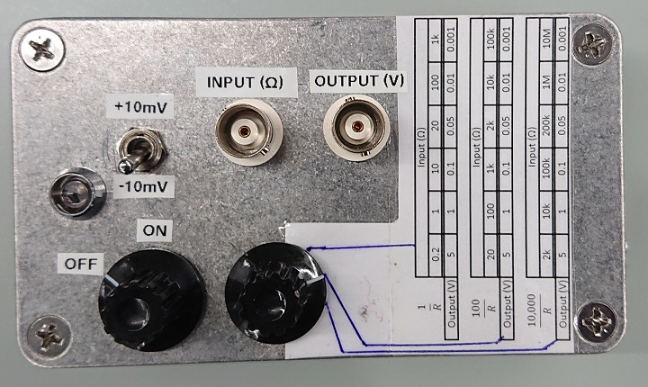
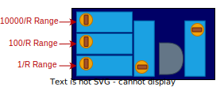

# Safe Ohmmeter

Multimeters can measure resistance, but may set a large voltage across the device under test. Inspired by a [project in Delft](https://qtwork.tudelft.nl/~schouten/oldstuff/viboxjunction-p.htm), this is a modernised circuit that:

- Sets a fixed $10\textnormal{mV}$ across the sample
- Maps the resulting resistance into a voltage that is inversely proportional to the measured resistance
- This voltage can be read using a conventional multimeter set to voltage measurement mode

That is, this is a simple device aids in measuring resistance while keeping a safe voltage across the device under test.

## General usage

The device runs off 3 AAA batteries:

  

The operation is as follows:

- The left dial turns on the device. When moving it midway between OFF and ON, it will light the LED to show that the battery is functional
- The toggle switch switches the polarity of the probe voltage across the device under test (measured from centre-pin to the ground-shield of the isolated BNC connector)
- The device under test is connected into the BNC connector labelled INPUT
- The resistance of the device under test is mapped onto a voltage from 1mV to 5V given by the range set by the right dial (selecting over: $1/R$, $100/R$ and $10000/R$). Measure this voltage via a multimeter connected to the OUTPUT BNC connector

There is a handy table that helps with the conversion between measured voltage and the sample resistance.

## Recalibrating the gains

To recalibrate open the box and connect a resistor across the input and measure the voltage as follows:

- To tune the $1/R$ range, connect a $10\Omega$ resistor across the input and turn the $1/R$ trimpot so that the output reads exactly $0.1\textnormal{V}$.
- To tune the $100/R$ range, connect a $1\textnormal{k}\Omega$ resistor across the input and turn the $100/R$ trimpot so that the output reads exactly $0.1\textnormal{V}$.
- To tune the $10000/R$ range, connect a $100\textnormal{k}\Omega$ resistor across the input and turn the $10000/R$ trimpot so that the output reads exactly $0.1\textnormal{V}$.

The three trimpots on the PCB corresponding to the three ranges are:

  

## Method of operation

View the full schematic [here](Docs/Schematic.pdf). The device is a simple OPAMP amplifier:

- The OPAMP is fed a constant DC $10\textnormal{mV}$ on its $+$ input
- Since it is in negative feedback mode, the voltage on the $-$ input is also $10\textnormal{mV}$
- KCL at the $-$ input for a sample resistance $R_s$ and feedback resistance $R_f$ gives $V_-/R_S+(V_--V_{out})/R_f=0$
- This simplifies into: $V_{out}=R_f/R_sV_-+V_-$. Since the output is measured with respect to $V_+=V_-$, the stray $V_-$ disappears to give $V_{meas}=0.01R_f/R_s$
- The three ranges thus, take $R_f=100\Omega$, $R_f=10\textnormal{k}\Omega$ and $R_f=1\textnormal{M}\Omega$.

There are additional diodes to clamp the voltage as a protective measure. The voltage reference is also tuned to give $10\textnormal{mV}$ (although it can be compensated with the feedback trimpots as well).

